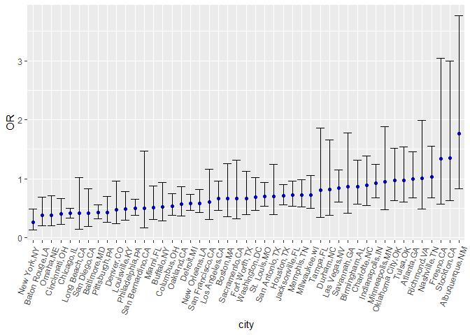
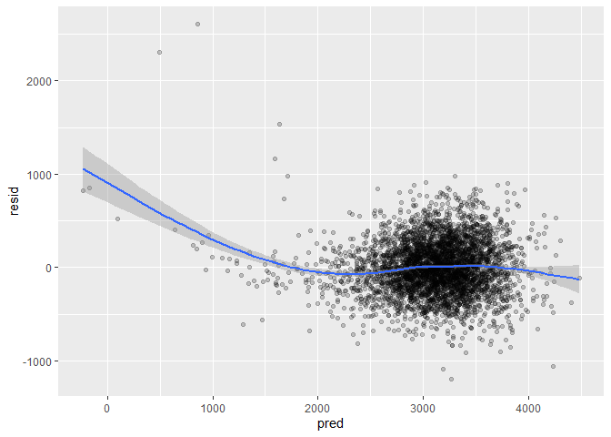
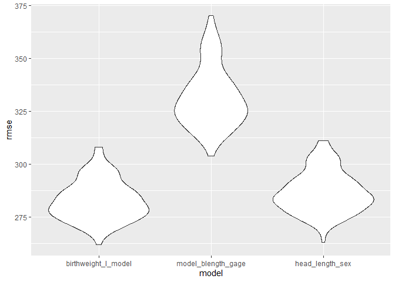

HW6
================
Shi Tiancheng
2024-12-02

``` r
library(tidyverse)
```

    ## ── Attaching core tidyverse packages ──────────────────────── tidyverse 2.0.0 ──
    ## ✔ dplyr     1.1.4     ✔ readr     2.1.5
    ## ✔ forcats   1.0.0     ✔ stringr   1.5.1
    ## ✔ ggplot2   3.5.1     ✔ tibble    3.2.1
    ## ✔ lubridate 1.9.3     ✔ tidyr     1.3.1
    ## ✔ purrr     1.0.2     
    ## ── Conflicts ────────────────────────────────────────── tidyverse_conflicts() ──
    ## ✖ dplyr::filter() masks stats::filter()
    ## ✖ dplyr::lag()    masks stats::lag()
    ## ℹ Use the conflicted package (<http://conflicted.r-lib.org/>) to force all conflicts to become errors

``` r
library(ggplot2)
library(modelr)
library(mgcv)
```

    ## 载入需要的程序包：nlme
    ## 
    ## 载入程序包：'nlme'
    ## 
    ## The following object is masked from 'package:dplyr':
    ## 
    ##     collapse
    ## 
    ## This is mgcv 1.9-1. For overview type 'help("mgcv-package")'.

``` r
library(broom)
```

    ## 
    ## 载入程序包：'broom'
    ## 
    ## The following object is masked from 'package:modelr':
    ## 
    ##     bootstrap

Problem 2

``` r
# read the data and create the variable: city_state
homicide_data = read.csv("data/homicide-data.csv", na = c("Unknown", "NA", ""))
homicide_data = homicide_data |> mutate(city_state = paste(city,state,sep=","))
```

``` r
# clean the dataset
tidy_homicide_data = filter(homicide_data, 
                            city_state != "Dallas,TX" & 
                              city_state != "Phoenix,AZ" & 
                              city_state != "Kansas City,MO" & 
                              city_state != "Tulsa,AL" & 
                              (victim_race == "White" | victim_race == "Black") &
                              victim_age != "Unknown" &
                              victim_age != "NA")
tidy_homicide_data$victim_age = as.numeric(tidy_homicide_data$victim_age)
tidy_homicide_data = mutate(tidy_homicide_data, 
                            solved = if_else(disposition == "Closed by arrest", 1, 0))
```

``` r
#filter the data of Baltimore, MD
Baltimore_homicide_data = filter(tidy_homicide_data,
                                 city_state == "Baltimore,MD")
```

``` r
# fit a glm of Baltimore, MD
Baltimore_glm = glm(solved~ victim_age+victim_sex+victim_race, data = Baltimore_homicide_data, family = binomial())
```

``` r
Baltimore_glm |> broom::tidy(conf.int = TRUE) |>
  mutate(OR = exp(estimate), CI.low = exp(conf.low),CI.high = exp(conf.high)) |>
  filter(term == "victim_sexMale") |>
  select(term,OR,CI.low,CI.high)
```

    ## # A tibble: 1 × 4
    ##   term              OR CI.low CI.high
    ##   <chr>          <dbl>  <dbl>   <dbl>
    ## 1 victim_sexMale 0.426  0.324   0.558

``` r
cities_glm = tidy_homicide_data |>
  group_by(city_state) |>
  nest() |>
  mutate(
    city_glm = map(data, ~ glm(solved ~ victim_age + victim_sex + victim_race, data = ., family = binomial())),
    oddsratio = map(city_glm, ~ broom::tidy(.x, conf.int = TRUE) |>
                      mutate(OR = exp(estimate), CI.low = exp(conf.low),CI.high = exp(conf.high)) |>
                      filter(term == "victim_sexMale") |>
                      select(term,OR,CI.low,CI.high))) |>
                      unnest(oddsratio) |>
  select(city_state, OR, CI.low, CI.high)
```

``` r
cities_glm
```

    ## # A tibble: 47 × 4
    ## # Groups:   city_state [47]
    ##    city_state        OR CI.low CI.high
    ##    <chr>          <dbl>  <dbl>   <dbl>
    ##  1 Albuquerque,NM 1.77   0.825   3.76 
    ##  2 Atlanta,GA     1.00   0.680   1.46 
    ##  3 Baltimore,MD   0.426  0.324   0.558
    ##  4 Baton Rouge,LA 0.381  0.204   0.684
    ##  5 Birmingham,AL  0.870  0.571   1.31 
    ##  6 Boston,MA      0.667  0.351   1.26 
    ##  7 Buffalo,NY     0.521  0.288   0.936
    ##  8 Charlotte,NC   0.884  0.551   1.39 
    ##  9 Chicago,IL     0.410  0.336   0.501
    ## 10 Cincinnati,OH  0.400  0.231   0.667
    ## # ℹ 37 more rows

``` r
ggplot(cities_glm, aes(x=reorder(city_state, OR), y = OR)) +
  geom_point(color = "blue") +
  geom_errorbar(aes(ymin = CI.low, ymax = CI.high)) +
  labs(x = "city") +
  theme(axis.text.x = element_text(angle = 70, hjust = 1))
```

<!-- -->

Problem3

``` r
birthweight = read.csv("data/birthweight.csv")
birthweight = drop_na(birthweight)
```

``` r
# fit a linear model of birthweight
birthweight_l_model = lm(bwt~babysex+bhead+blength+delwt, data = birthweight)
summary(birthweight_l_model)
```

    ## 
    ## Call:
    ## lm(formula = bwt ~ babysex + bhead + blength + delwt, data = birthweight)
    ## 
    ## Residuals:
    ##      Min       1Q   Median       3Q      Max 
    ## -1190.46  -183.99   -11.13   178.38  2605.82 
    ## 
    ## Coefficients:
    ##              Estimate Std. Error t value Pr(>|t|)    
    ## (Intercept) -6216.164     98.769 -62.936  < 2e-16 ***
    ## babysex        39.228      8.783   4.466 8.16e-06 ***
    ## bhead         144.780      3.486  41.537  < 2e-16 ***
    ## blength        82.378      2.062  39.941  < 2e-16 ***
    ## delwt           2.074      0.201  10.316  < 2e-16 ***
    ## ---
    ## Signif. codes:  0 '***' 0.001 '**' 0.01 '*' 0.05 '.' 0.1 ' ' 1
    ## 
    ## Residual standard error: 285.1 on 4337 degrees of freedom
    ## Multiple R-squared:  0.6905, Adjusted R-squared:  0.6902 
    ## F-statistic:  2419 on 4 and 4337 DF,  p-value: < 2.2e-16

``` r
model_1_data <- birthweight |>
  add_predictions(birthweight_l_model) |>
  add_residuals(birthweight_l_model)
```

``` r
#plot the model
ggplot(model_1_data, aes(x = pred, y = resid)) +
  geom_point(alpha = 0.2) +
  geom_smooth()
```

    ## `geom_smooth()` using method = 'gam' and formula = 'y ~ s(x, bs = "cs")'

<!-- -->

``` r
model_blength_gage = lm(bwt~blength + gaweeks, data = birthweight)
model_head_length_sex = lm(bwt~blength*babysex*bhead, data = birthweight)
```

``` r
compare = crossv_mc(birthweight, 100) |> mutate(train = map(train, as_tibble),
                                      test = map(test, as_tibble))
```

``` r
compare = compare |> mutate(
    birthweight_l_model = 
      map(train, \(df) lm(bwt~babysex+bhead+blength+delwt, data = df)),
    model_blength_gage = 
      map(train, \(df) lm(bwt~blength+gaweeks, data = df)),
    model_head_length_sex = 
      map(train, \(df) lm(bwt~bhead*blength*babysex, data = df)),
    rmse_birthweight_l_model = 
      map2_dbl(birthweight_l_model, test, \(mod, df) rmse(model = mod, data = df)),
    rmse_model_blength_gage = 
      map2_dbl(model_blength_gage, test, \(mod, df) rmse(model = mod, data = df)),
    rmse_head_length_sex = 
      map2_dbl(model_head_length_sex, test, \(mod, df) rmse(model = mod, data = df))
    
)
```

``` r
compare |> 
  select(starts_with("rmse")) |> 
  pivot_longer(
    everything(),
    names_to = "model", 
    values_to = "rmse",
    names_prefix = "rmse_") |> 
  mutate(model = fct_inorder(model)) |> 
  ggplot(aes(x = model, y = rmse)) + geom_violin()
```

<!-- -->
